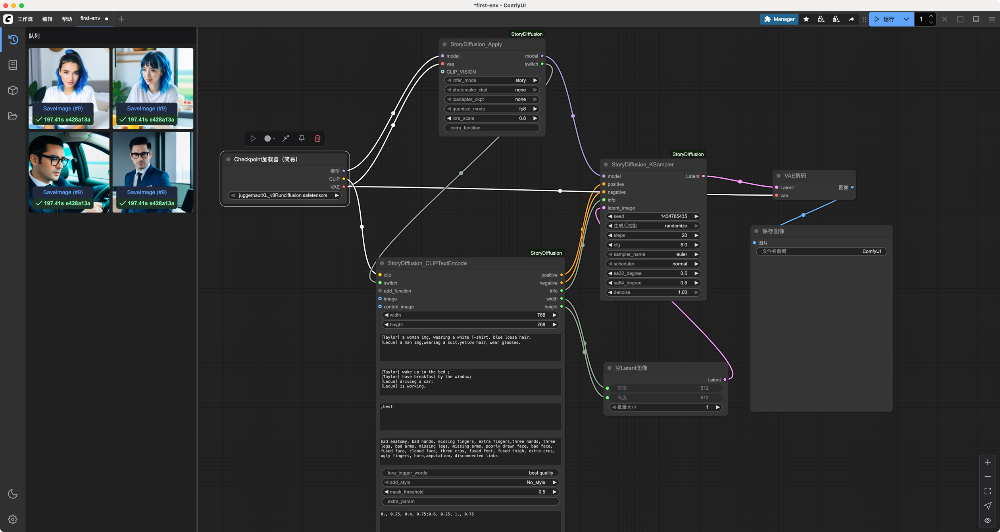
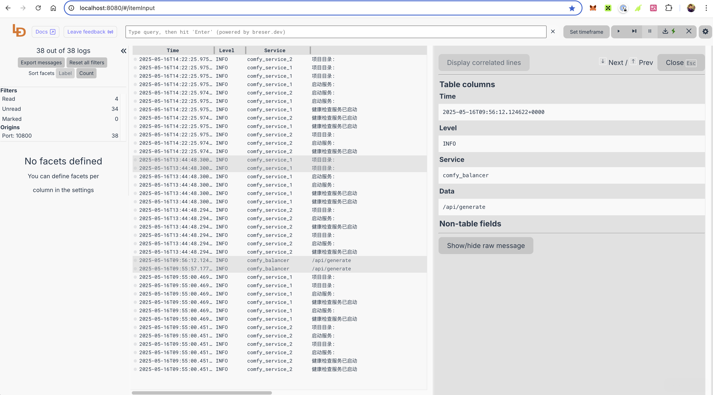
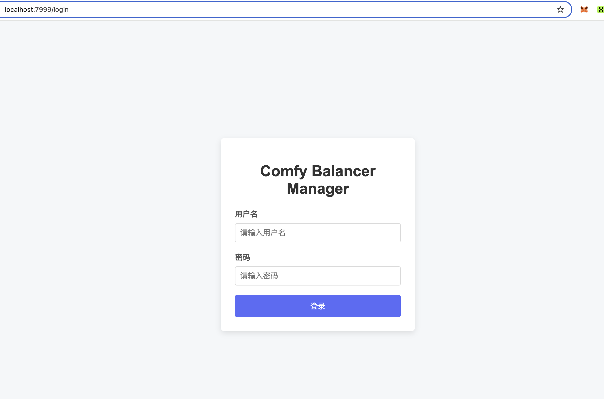
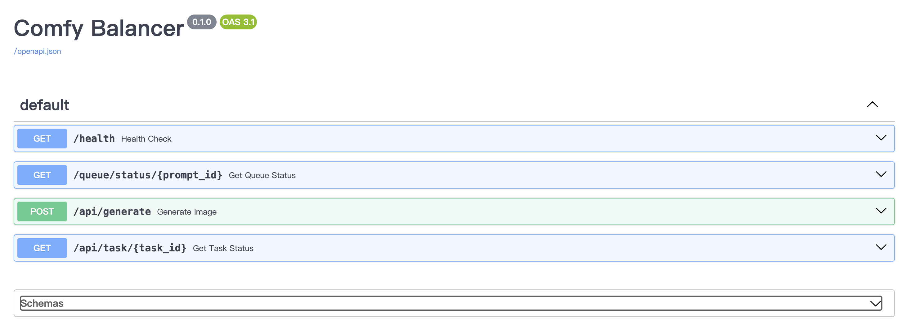
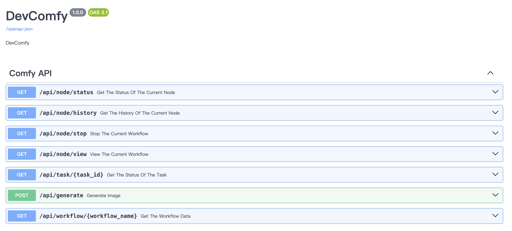

# Comfy 服务系统说明文档

[开发过程记录](Document.md)


## 系统概述

Comfy 服务系统是一个分布式图像生成服务，由三个主要组件组成：
- Comfy Service：核心服务节点，负责实际的图像生成任务
- Comfy Balancer：负载均衡器，负责任务分发和节点管理
- ComfyUI: 负责最终图片渲染生成动作 


## 环境依赖
- MacOS M1 32G
- Python3.11
- Redis
- Logdy 轻量级日志查看平台 

## 安装运行说明

- 服务安装说明
  ```shell
  docker-compose up
  ```
  - Logdy 日志平台 : http://localhost:8080
  - Balancer 后台 : http://localhost:7999
    - 输入用户名：`comfy` 密码:`comfy119..` 后进入swagger页面调试接口
  - Service 1 : http://localhost:8101
    - 输入用户名：`comfy` 密码:`comfy119..` 后进入swagger页面调试接口
  - Service 2 : http://localhost:8102
  
- ComfyUI 安装参考
  - 客户端 : Win & MacOS [官网下载](https://www.comfy.org/download)
  - 源码安装: [https://github.com/comfyanonymous/ComfyUI](https://github.com/comfyanonymous/ComfyUI)
  - 安装完成后可直接打开app，也可以用浏览器访问http://localhost:8000 (二者等效)

- 开发调试
  ```shell
  docker-compose down && docker-compose up --build
  ``` 
- 服务配置说明，主要是[docker-compose.yml](docker-compose.yml) 文件中配置的参数,大部分参数已暴露出来,这里仅列出组件相关参数，忽略logdy和redis的
  ```yaml

      comfy_balancer:
        build:
          context: ./comfy-balancer
          dockerfile: Dockerfile
        ports:
          - 7999:7999
        depends_on:
          - redis
        environment:
          API_USERNAME: "comfy"
          API_PASSWORD: "comfy119.."
          SERVICE_HOST: "comfy_balancer"
          SERVICE_PORT: 7999
          REDIS_HOST: "redis"
          REDIS_PORT: "6379"
          REDIS_PASSWORD: "PAssWord123"
          REDIS_DB: "0"
        networks:
          - comfy_net

      comfy_service_1:
        build:
          context: ./comfy-service
          dockerfile: Dockerfile
        ports:
          - 8101:8101
        env_file:
          - ./comfy-service/.env
        environment:
          SERVICE_HOST: "comfy_service_1"
          SERVICE_PORT: 8101
          REDIS_HOST: "redis"
          REDIS_PORT: "6379"
          REDIS_PASSWORD: "PAssWord123"
          REDIS_DB: "0"
          API_USERNAME: "comfy"
          API_PASSWORD: "comfy119.."
        depends_on:
          - redis
          - logdy
        networks:
          - comfy_net
  ``` 

## 组件说明

### Comfy Balancer

#### 文件说明

```shell
comfy-balancer
├── config.py
├── Dockerfile
├── logger.py
├── main.py
├── requirements.txt
└── web.py
```

### Comfy Service

#### 文件说明

```shell
comfy-service
├── comfy_api.py
├── config.py
├── Dockerfile
├── health_check.py
├── logger.py                 
├── main.py
├── models.py
├── paths.py
├── requirements.txt
├── web.py
└── workflows
    ├── first-workflow-api.json
    └── first-workflow.json
```

- `workflows`： 配置文件说明，一套流程的api描述文件和模板文件`前缀`命名需要一致，
  - api文件由ui界面导出 ，操作路径`工作流->导出（API）`
  - 模板文件从ComfyUI安装时设置的工作目录获取，路径`{WORK_HOME}/user/default/workflows`

#### 其他文件

```shell
test
├── CompyUI.http    # ComfyUI 接口测试的http请求文件
├── app-prompt.json # api数据
├── logdy_test.http # logdy平台测试的http请求文件
└── prompt.json     # 模板数据
```

## 部署图


## 效果

- ComfyUI

  workflow设计,对照ComfyUI_StoryDiffusion中Example 
   
  
  渲染结果
    
  
- Logdy 

  

- Balancer

  

  仅包含图片生成，任务查询主要接口
  

- Service

  包含围绕图片生成，comfyUI节点信息绝大部分接口
  

---  

### 待完善 & 思考

- [ ] 基于先实现主要流程和功能的原则,ComfyUI并为使用源码安装,需编写配套安装的shell脚本
- [ ] 告警信息推送功能
- [ ] comfy_api.py 中workflow.json 每次request都要从文件加载，浪费IO，可改成一次load 扔到redis中；
- [ ] 优化日志记录功能, 目前只有应用日志输出到logdy中，应将comfyUI中执行日志收集过来
  - 思路1: 读comfyUI文件输出到logdy中,但是观察了/Users/xxx/Library/Logs/ComfyUI中的日志，也并不是那完善和详细 没有task具体执行过程中的日志，可能是日志级别问题，后续研究下
  - 思路2: 所有comfyUI web请求逻辑都集中在server.py 中，可在这里二次开发参考service中`logger.py`的套路，把关键日志通过tcp方式扔到logdy中
- [ ] comfyUI 通过UI导出api.json 比较麻烦。[comfy-cli](https://docs.comfy.org/comfy-cli/reference) 好像有这块能力
  - 理想状态： ui中编辑workflow，自动发布到service平台完成并装载，当然取决于workflow的成熟度是否高频，毕竟生成图片全依赖这个，发布后会有版本控制一系列问题
- [ ] 两个服务web启动都用了uvicorn,目前还是main中run单进程work工作，上生产前启动要换成cli调用，这样可以开多work，提高并发能力
- [ ] balancer 现在还是一个单实例的微网关，这么设计取决于要基于节点资源cpu、gpu处理能力来请求分发,或者基于其他某种业务上的策略分发请求和任务调度，这种重要角色还是应该用撸棒一些的方案
  - 更稳妥方案 ：使用成熟网关OpenResty，集成了Lua脚本、第三方模块和工具链方便定制各种业务规则和场景，二次开发利器。高并发（10万+ QPS）轻松应对。

#### 参考资料

- https://github.com/smthemex/ComfyUI_StoryDiffusion
- https://github.com/comfyanonymous/ComfyUI
- https://docs.comfy.org/get_started/introduction
- https://github.com/zjf2671/hh-mcp-comfyui
- https://logdy.dev/docs/reference/code
- https://hub.docker.com/r/rickraven/logdy

