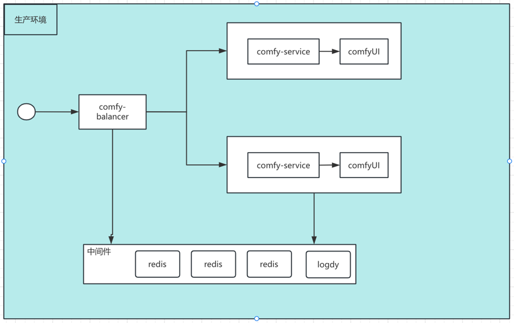
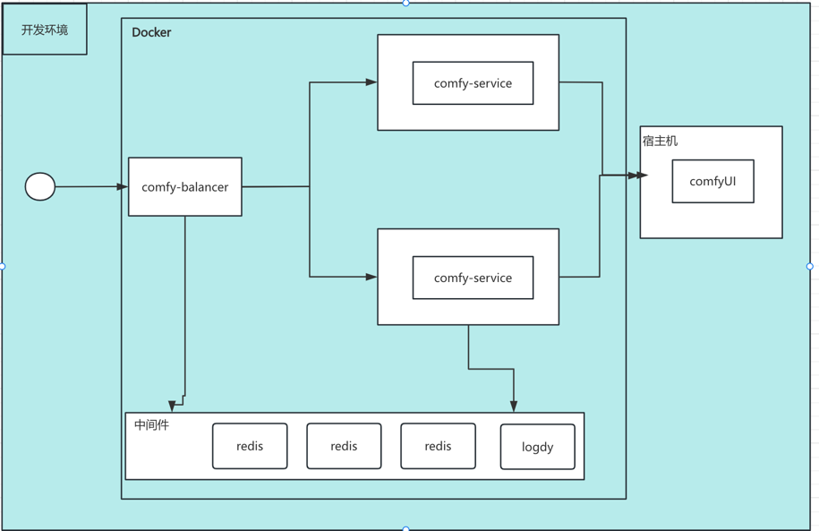

# Comfy 服务系统说明文档

[开发过程记录](Document.md)

## 系统概述

Comfy 服务系统是一个分布式图像生成服务，由三个主要组件组成：
- Comfy Service：核心服务节点，负责实际的图像生成任务
- Comfy Balancer：负载均衡器，负责任务分发和节点管理
- ComfyUI: 负责最终图片渲染生成动作 

## 组件说明

### Comfy Balancer

### Comfy Service

## 部署图

